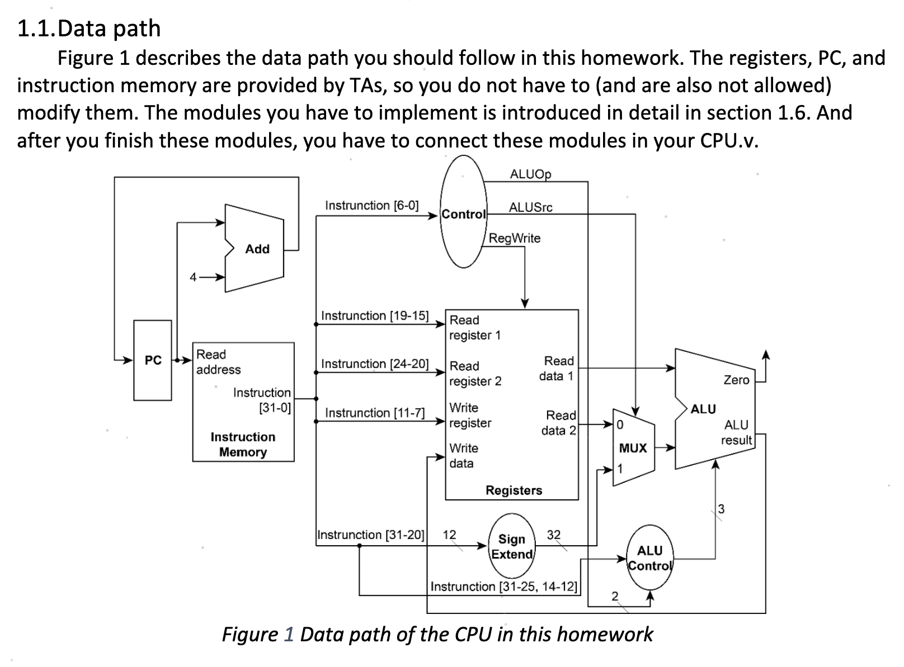
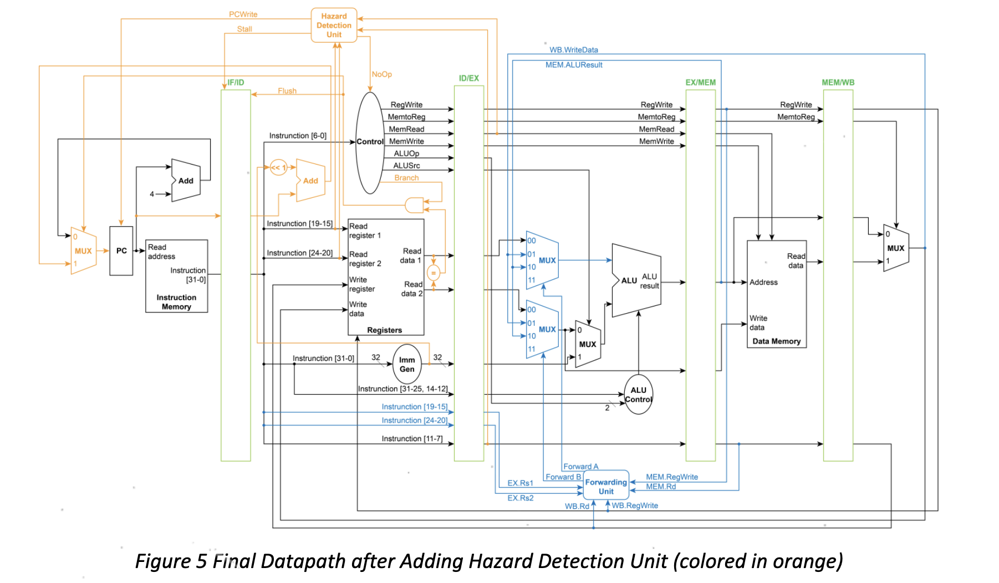
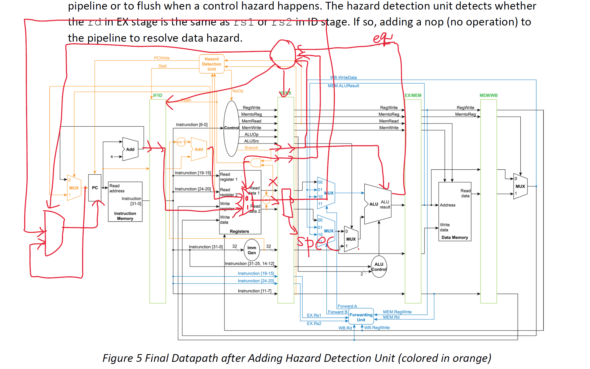

# Computer Architecture Labs

### lab1 - single cycle

In this lab, a single-cycle CPU design is explored. A single-cycle CPU completes an entire instruction in a single clock cycle. It simplifies the control logic but might not be the most efficient in terms of clock cycle utilization.

### lab2 - pipelined CPU

This lab delves into a pipelined CPU architecture. Unlike a single-cycle CPU, a pipelined CPU breaks down instruction execution into several stages (fetch, decode, execute, etc.), allowing multiple instructions to be processed simultaneously in different stages of the pipeline. This often leads to better performance by overlapping instruction execution.

### lab3 - predictor

The third lab is centered around a predictor, namely a branch predictor in the context of CPU design. Branch prediction is crucial in pipelined architectures to predict the outcome of branches (like if/else or loops) before their results are known, thereby reducing pipeline stalls.

### Conclusion

In summary, these labs progressively cover CPU design concepts, starting from a basic single-cycle structure and advancing to more sophisticated pipelining and prediction mechanisms using Verilog.

> sign: 20231219 rbt4168
